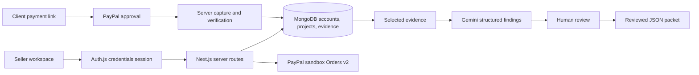

# DeliveryProof

**You delivered the work. Keep the proof.**

Built for the [PayPal AI Hackathon](https://paypalaihackathon.devpost.com/).
DeliveryProof gives freelancers and small studios a record of what was agreed, what was paid,
and what was handed over—then helps them review that evidence when a delivery is questioned.

## The problem

A PayPal capture proves a payment happened. It does not explain the scope of a design project,
where the final files went, or whether the client acknowledged receipt. Those details often live
in different tools. Reconstructing the story during a dispute is slow, and a plausible AI-written
response can make things worse if it introduces facts the seller cannot support.

DeliveryProof keeps those records separate and connected. A seller-saved link is labelled as a
seller record. A PayPal payment is recorded only after the server verifies a completed capture.
Missing acknowledgement remains missing.

## What PayPal and AI actually do

**PayPal is the payment source of truth.** Each seller connects their own sandbox REST app.
DeliveryProof creates an Orders v2 order for the stored project amount and produces a client
payment link. The client approves in PayPal, then completes the capture. The server checks the
order, project reference, USD amount, capture status, and capture ID before marking the project paid.
Request IDs are saved before provider calls so retries reuse the same operation.

**Gemini checks selected evidence.** It returns structured findings with source IDs and a list of
gaps. The server loads records belonging to the signed-in account and rejects unknown citations.
The reviewer checks the wording and prepares a JSON packet containing the draft and original
source snapshots. Valid citations still need human review; they do not guarantee factual accuracy.

**Gemini also reviews the handover before a dispute.** From each project's scope it builds concrete
delivery checkpoints, maps them to original evidence, flags partial or missing documentation,
and proposes next actions in the workspace. Agreement-only claims cannot count as supported
delivery. Its suggested client message can be reviewed and copied. Reviews persist in MongoDB
and are marked stale when the scope, payment, delivery, or evidence changes. It reads uploaded
PDFs, images and numbered text, comparing their contents with the agreed requirements. Findings
link to original files and cite a page, line or visual observation. External delivery URLs are not opened.

**Original files stay private.** Upload review files from the AI review tab.
UploadThing stores AES-256-GCM encrypted originals; MongoDB holds their metadata and SHA-256 fingerprints.
The server checks ownership and hashes before downloading or sending originals to the model.
Limits: eight files per project, 4 MB per file, 12 MB total; PDFs up to 25 pages and UTF-8 text
up to 256 KB. Supported formats: PDF, PNG, JPEG, WebP, TXT, MD, CSV, JSON and SVG source.
SVG is inspected as text, never rendered as active markup. Uploads preserve evidence; they do not
replace the external delivery link or record client receipt. All files are sent only when you run review.

**Clients can acknowledge receipt.** In Delivery, generate a seven-day confirmation link and
share it with the client. Their self-declared name and timestamp become an append-only
Acknowledgement record. The signed-in seller cannot acknowledge their own delivery. Receipt
does not imply satisfaction or verified identity. Changing the delivery URL invalidates the old
confirmation link and requires a fresh receipt. Acknowledgement never marks a project paid.

This is a sandbox prototype, not a dispute adjudicator. It does not promise Seller Protection,
a winning outcome, live settlement, or automatic submission to PayPal.

## Run it

Requirements: Node.js 22 or later, npm, and a PayPal Developer sandbox app.

```powershell
npm install
npm run setup:local
npm run db:local
```

Keep MongoDB running, then start the app in a second terminal:

```powershell
npm run dev
```

Open http://localhost:3000. The local MongoDB launcher downloads its binary on first use, binds
to 127.0.0.1:27017, and preserves WiredTiger data in `.data/mongodb`. Use a managed MongoDB URI
for hosting. Do not run another MongoDB process on the same port.

`setup:local` adds missing values to `.env.local` and preserves existing ones. Configure:

| Setting | Purpose |
| --- | --- |
| `MONGODB_URI` | Local connection is generated; use Atlas for a hosted build |
| `AUTH_SECRET` | Generated locally; signs Auth.js sessions |
| `APP_ENCRYPTION_KEY` | Generated locally; encrypts seller PayPal credentials; keep it stable |
| `GEMINI_API_KEY`, `GEMINI_MODEL` | Google AI Studio key and a model supporting structured JSON |
| `APP_ORIGIN` | Public app origin when hosted, including scheme |
| `UPLOADTHING_TOKEN` | Enables the authenticated upload server endpoint |
| `ELASTIC_URL`, `ELASTIC_API_KEY` | Configures the evidence-search adapter; automatic indexing is not wired yet |

The seller connects PayPal **inside Account settings**, rather than sharing a global merchant
across every app user. Existing server PayPal environment credentials are used by service adapters;
they are not automatically assigned to user accounts. Never commit secrets or customer evidence.

## In-app help

Choose **How to use** in the workspace toolbar. It explains the seller and client roles, the
four-step workflow and how to test it as a judge. New accounts also see a **Start here** card.
The judge guide includes a downloadable sample file with an intentionally missing scope item.
AI uploads are for review; the Delivery tab holds the client-facing URL and receipt link.

## Judge walkthrough: one project, one payment, one evidence review

1. Visit the landing page and create an account. New workspaces start empty.
2. In PayPal Developer, create a **business sandbox account** and a REST sandbox app linked to it.
   In DeliveryProof → Account, connect that app's Client ID and Secret.
3. Create a project with a scope and USD amount. Open its overview and create a payment link.
   Use **New payment** (refresh icon) to replace an unpaid checkout after changing sandbox
   receiving preferences or when a link expires. Share the new link: the previous app link
   stops working. Approved orders and capture attempts must be completed or reconciled first.
   The app link lasts seven days, but PayPal orders normally have a three-hour checkout
   window. We check order availability before showing approval and allow **New payment**
   to recover a confirmed missing order only when no capture has been attempted.
4. Open the link in a separate browser profile. Approve using a **personal sandbox account**,
   return to the payment page, then choose **Complete & verify payment**. These are test funds.
5. Check the business sandbox transaction history. Refresh the seller's project: its Payment
   evidence now contains the verified capture reference.
6. In **AI review**, upload a real PDF or text deliverable that intentionally lacks one agreed item.
   Choose **Check files with AI**, expand its checkpoints and inspect the page/line citations and missing item.
   Follow a suggested action to Delivery and save a real HTTPS handover link.
7. Generate a confirmation link, open it in a separate browser profile, and acknowledge receipt.
   Refresh confirmation status in the seller's Delivery tab. Inspect the new Acknowledgement source.
8. Open Response, select records, and describe a test concern such as “The client says the files
   were not received.” Run Gemini. Inspect its sources and missing acknowledgement.
9. Review the draft, preserve the gaps, prepare the packet, and download the JSON.

PayPal accounts: https://developer.paypal.com/dashboard/accounts
Sandbox apps: https://developer.paypal.com/dashboard/applications/sandbox
Orders flow: https://developer.paypal.com/whats-an-order/

## Suggested demo video: under three minutes

- **0:00–0:25:** Explain the freelancer's scattered payment and delivery records.
- **0:25–1:20:** Create a project, show client approval and capture, then the seller's verified receipt.
- **1:20–2:15:** Save delivery evidence, run Gemini, and highlight a supported finding and a gap.
- **2:15–2:50:** Review and download the packet. Explain why payment, access, and acceptance differ.

Record actual flows. Do not replace failed provider calls with success screens.

## Architecture



`src/proxy.ts` is the Next.js 16 middleware convention. It protects the workspace and redirects
signed-in users away from auth pages. API routes also verify sessions and account ownership.
Merchant secrets use AES-256-GCM. Original evidence is appended; project updates cannot set payment
or acknowledgement status. Public payment links are random bearer URLs with seven-day expiry.

## Working today and unfinished work

| Area | Status |
| --- | --- |
| Landing, animated auth UI, sign-up/sign-in/sign-out, profile settings | Working |
| Account-isolated MongoDB projects, scope and delivery history | Working |
| Seller sandbox connection and Orders v2 creation | Tested against PayPal sandbox, including stable-link retry, fresh checkout generation, and old-link invalidation |
| Client approval and verified capture | Implemented with validation tests; the full buyer approval/capture still needs a manual walkthrough |
| Gemini selected-evidence analysis, citation checks, reviewed JSON packet | Working code path; requires a valid Gemini key/model and quota |
| UploadThing | Encrypted original uploads, project ownership checks, integrity-checked downloads and file-review UI |
| Elastic, a hackathon sponsor | Account/project-filtered service adapter and tests; indexing and search UI are pending |
| Client acknowledgement | Working shared-link flow with explicit receipt, timestamp, ownership checks, idempotency, and changed-link invalidation; link-holder identity is self-declared |
| Gemini handover checkpoints and next actions | Working; structured, cited scope review with persisted results and stale-review detection |
| File-content inspection | Implemented with page/line citations and original-file validation |
| Independent client identity verification | Pending |
| Dispute import, verified webhooks, refunds, PDF export, PayPal evidence submission | Pending |
| Email verification, password recovery, production merchant onboarding | Pending |

## Host the complete app on Render

The [Render Blueprint](render.yaml) builds and runs the full Next.js app, including auth and API
routes. `/api/health` checks MongoDB connectivity. No local disk is needed for uploaded originals.

1. Create a hosted MongoDB database and a dedicated database user. Allow the Render service's
   outbound IP addresses in MongoDB network access. Do not use the local `127.0.0.1` URI on Render.
2. In Render, choose **New → Blueprint**, connect this repository and review `render.yaml`.
3. Supply `MONGODB_URI`, `GEMINI_API_KEY`, `GEMINI_MODEL` and `UPLOADTHING_TOKEN` in Render.
   Use the full UploadThing app token, not an individual API key. The free storage tier works: only encrypted bytes leave the server.
4. Set `APP_ORIGIN` and `AUTH_URL` to the exact HTTPS service URL with no trailing slash.
   Render generates `AUTH_SECRET`. Generate `APP_ENCRYPTION_KEY` as 64 hexadecimal characters
   (`node -e "console.log(require('crypto').randomBytes(32).toString('hex'))"`) and keep it stable.
   If migrating existing merchant records, retain their original encryption key instead.
5. Deploy, verify `/api/health` returns 200, create an account and connect a PayPal sandbox app
   inside Account. Complete the walkthrough below with distinct seller and buyer accounts.

The blueprint explicitly uses the free plan; expect cold starts after inactivity. Choose an
always-on plan in Render if needed for judging. No hosted URL is claimed until deployment succeeds.
The separate `dev:api` service is optional and is not needed for the product.
Deployment reference: [Render's Next.js guide](https://render.com/docs/deploy-nextjs-app).

## Verification

```powershell
npm run check
npm run test:product
npm run test:handover
# Optional: one real Gemini request using the configured key and model.
npm run test:handover -- --ai
# Also exercise private UploadThing storage, original download and real PDF inspection.
npm run test:handover -- --files --ai
```

`check` runs TypeScript, unit tests, service compilation, and the Next.js production build.
`test:product` requires the local app and database. It verifies account creation/session handling,
redirects, empty workspaces, persistent project APIs, tenant isolation, profile updates, and rejection
of client-written paid state. It cleans up only its own randomly named test records. Capture tests
reject mismatched order, project, amount, currency, and pending status.

`test:handover` creates isolated test accounts and verifies confirmation ownership, explicit
receipt, repeated-submit idempotency, changed-link invalidation, and preservation of unpaid
state. `--ai` also verifies a live structured review and stale-result detection. The script removes
its own projects, receipt links, reviews, and accounts afterward.

The UI supports mobile navigation, cookie-persisted light/dark mode, squircle surfaces, SVG path
animations, and reduced motion. SF Pro is preferred where installed; Windows uses the bundled Inter
fallback. No SF Pro font files are redistributed.

## Submission notes

The hackathon asks for a working PayPal + AI prototype, runnable instructions or a hosted demo,
a public source repository with an open-source license, and a public demo video under three minutes.
Before submitting, complete the real sandbox walkthrough, add the video URL, confirm repository
visibility, and add the deployed URL. Source code is available under the [MIT license](LICENSE).
